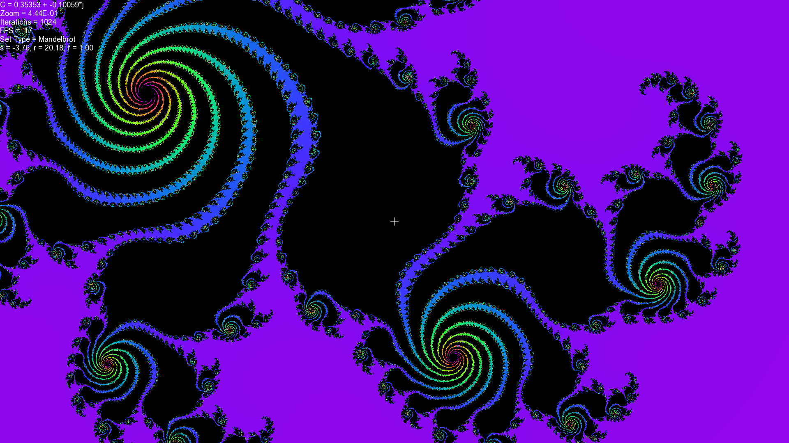

# Julia_Morph
My first C++ project utilizing CUDA acceleration and SFML API. This is a basic application that visualizes the Julia Set for an arbitrary complex value C in real time. On a GTX 1070 GPU, i5-4460 CPU, the application will generate 1920x1080 pixels at 60-80 frames per second. On worst case scenario, where the every coordinate on the screen is within the julia set, the FPS drops to 45. This is with a 540 blocksPerGrid, 480 threadsPerBlock configuration. The iteration threshold for each coordinate is 240.

The application visualizes the Julia set for the Mandelbrot Set as well as some of its variations as listed below.

	Mandelbrot : Z(n+1) = Z(n)^2 + C

	Burning Ship : Z(n+1) + |Z(n)^2| + C

	Cubic Mandelbrot : Z(n+1) = Z(n)^3 + C

	MandelBox : https://sites.google.com/site/mandelbox/what-is-a-mandelbox

Controls:

	W, A, S, D - shifts the value of C on the complex plane. In Mandelbox mode, shifts S and R values.

	Q, E - zooms in/out of center

	Left Mouse - specify new center

	R, F - increase/decrease iteration threshold

	LShift - high speed shifting

	LControl - low speed shifting

	1 - Burning Ship

	2 - Mandelbrot

	3 - Cubic Mandelbrot

	4 - Mandelbox

	Space - resets all parameters

