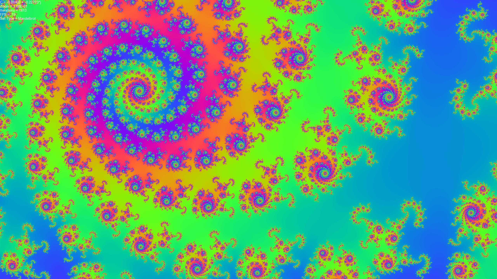
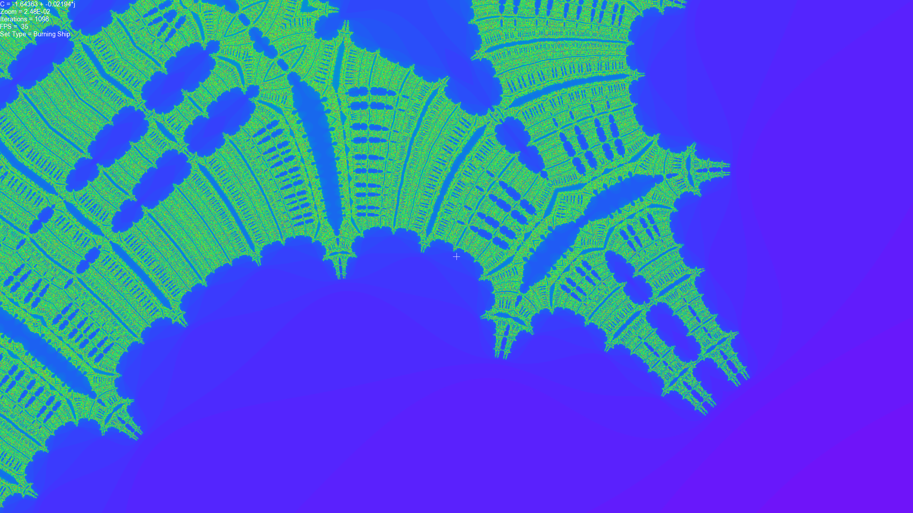
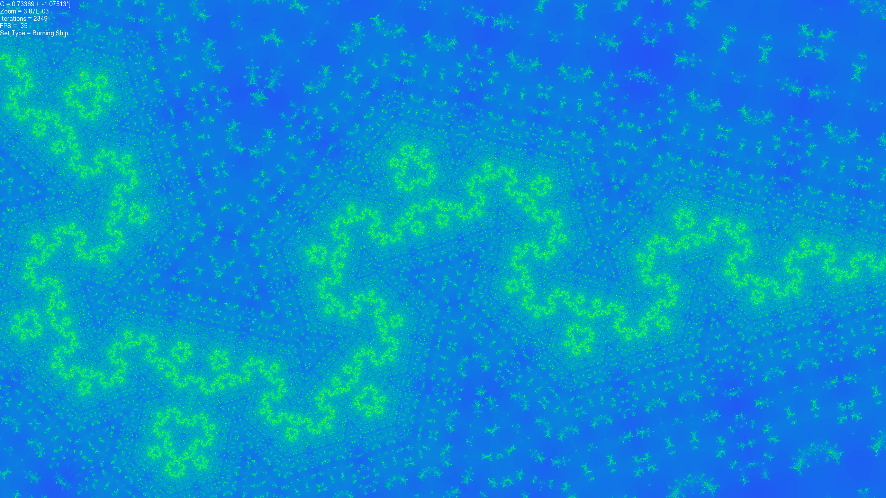

# Julia_Morph
A C++ application utilizing CUDA and SFML APIs. This is a basic application that visualizes the Julia Set for an arbitrary complex value C in real time at a high frame-rate. Compiling the project requires the CUDA and SFML APIs. Running the application requires a CUDA-enabled NVIDIA GPU.

The application visualizes the Julia set for the Mandelbrot Set as well as some of its variations as listed below.

	Mandelbrot : Z(n+1) = Z(n)^2 + C

	Burning Ship : Z(n+1) + |Z(n)^2| + C

	Cubic Mandelbrot : Z(n+1) = Z(n)^3 + C

	MandelBox : https://sites.google.com/site/mandelbox/what-is-a-mandelbox

Youtube Video Demos: 
	
https://www.youtube.com/watch?v=76CkgcJaLjI

https://www.youtube.com/watch?v=c5Z2mGP4zmE

Pictures:

